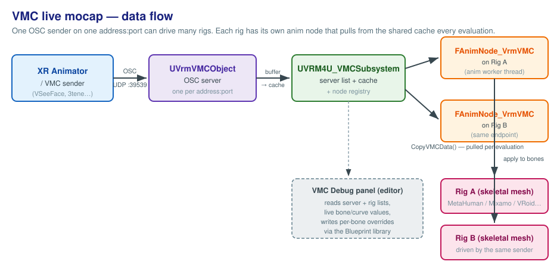
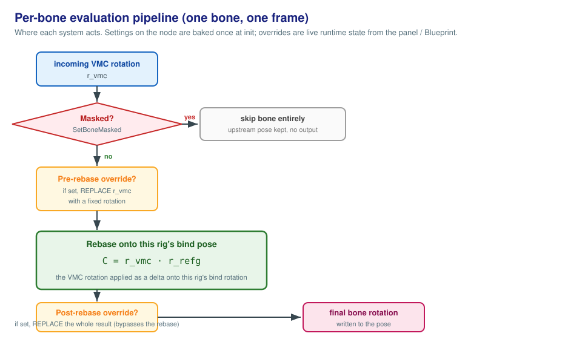

# VRM4U: VMC Live Mocap User Guide

> **Who this is for.** Anyone wiring up a character to a live VMC mocap stream in Unreal Engine 5.6.
> It covers setup, every setting, **when to use what**, and how to fix common problems. No C++ needed.
>
> **✦ = New in this fork.** Anything marked ✦ is a feature this fork adds on top of VRM4U's existing
> VMC support. Unmarked items are part of stock VRM4U. See [§1](#1-what-you-get) for the at-a-glance list.
>
> **Companion docs:** [`retarget-setup-wizard.md`](retarget-setup-wizard.md) (one-click MetaHuman/DAZ
> setup) and [`vmc-face-livelink-bridge.md`](vmc-face-livelink-bridge.md) (MetaHuman face from the VMC
> stream).

---

## Contents

1. [What you get](#1-what-you-get)
2. [How it fits together (architecture)](#2-how-it-fits-together-architecture)
3. [Quick start](#3-quick-start)
4. [The VMC anim node: every setting](#4-the-vmc-anim-node-every-setting)
5. [Performance modes](#5-performance-modes)
6. [Auto-populate (bone mapping)](#6-auto-populate-bone-mapping)
7. [Cross-skeleton rigs (MetaHuman / DAZ): the IK Retargeter](#7-cross-skeleton-rigs-metahuman--daz-the-ik-retargeter)
8. [Per-bone overrides & masks](#8-per-bone-overrides--masks)
9. [The VMC Debug panel](#9-the-vmc-debug-panel)
10. [Blueprint API reference](#10-blueprint-api-reference)
11. [Things to be careful about](#11-things-to-be-careful-about)
12. [Troubleshooting](#12-troubleshooting)
13. [Glossary](#13-glossary)

---

## 1. What you get

| Feature | ✦ New? | What it does | Where you use it |
|---|:--:|---|---|
| **VMC anim node** | base | Receives a live VMC/OSC stream and drives a humanoid skeleton from it | AnimGraph |
| **Auto-populate** | ✦ | Detects the skeleton family (VRoid/Mixamo/MetaHuman/DAZ) and fills the humanoid→bone map | Meta asset / node / right-click |
| **Retarget setup wizard + scene lint** | ✦ | One-click IK Retargeter pipeline for MetaHuman/DAZ, plus a scene checker | Actor right-click / Tools menu |
| **VMC face → LiveLink bridge** | ✦ | Publishes the VMC blendshape stream as a LiveLink ARKit subject so a MetaHuman face follows it | Actor right-click / component |
| **Per-bone overrides & masks** | ✦ | Pin, mute, or hand-pose individual bones/curves at runtime | Debug panel / Blueprint |
| **VMC Debug panel** | ✦ | Live editor panel to watch the stream and tune any bone/curve, save/load presets | Window ▸ VRM4U |
| **Blueprint API** | ✦ | Read live/applied/bind poses, set overrides, discover servers and rigs | Any Blueprint |
| **Performance modes** | ✦ | Throttle the apply rate (30/60/90/Adaptive/Custom) | Node settings |

---

## 2. How it fits together (architecture)

A VMC sender (XR Animator, VSeeFace, 3tene, …) broadcasts OSC over UDP. Inside Unreal, one OSC
**server object** exists per `address:port`, a single **engine subsystem** owns all servers and a
registry of which rigs are listening, and each rig's **anim node** pulls the latest pose every
evaluation. One sender can drive many rigs.



- **`UVrmVMCObject`**: the OSC server. One per unique `address:port`. Buffers incoming bone/blendshape
  messages and exposes the current snapshot.
- **`UVRM4U_VMCSubsystem`**: engine subsystem. Lazily creates/owns servers, hands out pose snapshots,
  and keeps a registry mapping each skeletal mesh component to its active VMC node. Tears everything
  down on PIE end.
- **`FAnimNode_VrmVMC`**: the AnimGraph node on each rig. Registers itself, then each frame copies the
  latest VMC data and applies it through the [per-bone pipeline](#8-per-bone-overrides--masks).

> **Threading:** the anim node evaluates on a worker thread. The OSC pump and server creation run on
> the game thread. All shared state is locked. You don't have to think about this unless you're
> extending the C++.

---

## 3. Quick start

1. **Enable the plugin** and restart the editor.
2. **Import or pick your character** (a VRM, or a Mixamo/MetaHuman/DAZ skeletal mesh).
3. **Get a humanoid bone map** (`UVrmMetaObject`). For VRM imports this exists already. For
   Mixamo/MetaHuman/DAZ, create a Meta object, assign the `SkeletalMesh`, and run
   [Auto-Populate](#6-auto-populate-bone-mapping).
4. **Open the character's Animation Blueprint** and add a **VRM VMC** node (`FAnimNode_VrmVMC`) into
   the AnimGraph, feeding the final pose.
5. **Point it at the stream:** leave `ServerAddress = 0.0.0.0` and `Port = 39539` (the VMC default)
   unless your sender uses another port. Assign your `VrmMetaObject` (or leave
   `EnableAutoSearchMetaData` on).
6. **Start your VMC sender**, then **Play (PIE)**. The character should move.
7. **Tune it live:** open **Window ▸ VRM4U ▸ VRM4U VMC Debug** to watch bones/curves and fix any that
   misbehave. See [§9](#9-the-vmc-debug-panel).
8. **MetaHuman / DAZ:** don't drive these directly with the VMC node. Use the one-click
   [IK Retargeter setup](#7-cross-skeleton-rigs-metahuman--daz-the-ik-retargeter) instead.
   For the MetaHuman **face**, run the one-click
   [VMC face LiveLink setup](#the-face-metahuman-the-vmc--livelink-bridge-) on top.

---

## 4. The VMC anim node: every setting

All settings live on the **VRM VMC** node in your AnimGraph. The **Network**, **Skeleton/mapping**,
and **Pose application** groups are stock VRM4U. **Performance** (✦) is added by this fork.

### Network

| Setting | Type | Default | Meaning |
|---|---|---|---|
| `ServerAddress` | string | `0.0.0.0` | Bind address. `0.0.0.0` = all interfaces (includes localhost). Use `127.0.0.1` to restrict to local senders. |
| `Port` | int | `39539` | UDP port. `39539` is the standard VMC port. |

### Skeleton / mapping

| Setting | Type | Default | Meaning |
|---|---|---|---|
| `EnableAutoSearchMetaData` | bool | `true` | If on and no `VrmMetaObject` is set, auto-find the humanoid map from the mesh. |
| `VrmMetaObject` | soft ref | none | The humanoid→bone map. Optional when auto-search is on. Assigning one with an empty map triggers [auto-populate](#6-auto-populate-bone-mapping). |

### Pose application

| Setting | Type | Default | Meaning |
|---|---|---|---|
| `bUseRemoteCenterPos` | bool | `true` | Apply the sender's root/hips translation. Turn off if your rig has its own root motion/controller. |
| `ModelRelativeScale` | float | `1.0` | Scales incoming translations (not rotations). >1 enlarges, <1 shrinks the motion. |
| `bIgnoreLocalRotation` | bool | `false` | Pose-application mode. When **on**, the incoming rotation is rebased onto this rig's bind pose (conjugated by the bind-pose rotation) instead of being applied directly as the bone's local rotation (the default, **off**). |
| `bApplyPerfectSync` | bool | `true` | Apply the full blendshape (Perfect Sync) curve set for facial capture. |

### Performance ✦

| Setting | Type | Default | Meaning |
|---|---|---|---|
| `PerformanceMode` | enum | `Streaming` | Apply-rate preset. See [§5](#5-performance-modes). |
| `CustomUpdateRate` | int | `60` | FPS used when `PerformanceMode = Custom`. Clamped to 30–120. Only shown in Custom mode. |
| `bForceUpdate` | bool | `false` | Advanced/hidden. Forces the server to flush even without frame-complete messages (non-standard senders). |

---

## 5. Performance modes

**✦ New in this fork.**

`PerformanceMode` sets how often the server flushes the latest buffered pose into the snapshot the
anim node reads, i.e. the effective **apply rate**. Incoming OSC is always received. The throttle
only governs how often it's pushed downstream. Senders that emit frame-complete messages
(`/VMC/Ext/OK`) force a flush regardless, so well-behaved senders are unaffected.

| Mode | Rate | Notes |
|---|---|---|
| **Performance** | 30 FPS | Lowest CPU. Fine for low-power machines. |
| **Balanced** | 60 FPS | Good default trade-off. |
| **Streaming** | 90 FPS | **Node default.** Highest responsiveness. Best for live streaming / 90 Hz. |
| **Adaptive** | ~60 base | Adjusts the rate based on observed frame times. |
| **Custom** | `CustomUpdateRate` | Your FPS, clamped to 30–120. |

---

## 6. Auto-populate (bone mapping)

**✦ New in this fork.**

The VMC node speaks **humanoid names** (`hips`, `leftUpperArm`, …). Your skeleton uses its own bone
names (`Hips`/`LeftArm` on Mixamo, `pelvis`/`upperarm_l` on MetaHuman, etc.). The humanoid→bone map
lives in a `UVrmMetaObject.humanoidBoneTable`. **Auto-populate fills that map for you.**

### What it does

Given a `UVrmMetaObject` with a `SkeletalMesh` assigned, auto-populate:

1. **Detects the skeleton family** by looking for characteristic bone names in the mesh's skeleton.
   Supported families: **VRM/VRoid, Mixamo, MetaHuman, DAZ (Genesis)**. (Detection keys on marker
   bones that are unique to each rig family.)
2. **Applies that family's mapping table**, filling `humanoidBoneTable` with `humanoidName → boneName`
   pairs.
3. **Reports** what it did via an editor notification.

### `SkeletonType`: Auto vs. explicit

The Meta object has a `SkeletonType` you set:

- **`Auto`** (default): run detection, then map.
- **`VRM` / `Mixamo` / `MetaHuman` / `DAZ`**: skip detection and force that family's table (use this
  when detection guesses wrong, e.g. a re-rigged or renamed skeleton).

### Two ways to trigger it

| # | Entry point | How |
|---|---|---|
| 1 | **Meta asset details button** | Open the `VrmMetaObject` and click **Auto-Populate** in the Rendering category. |
| 2 | **Anim-node auto-trigger** | Assign a `VrmMetaObject` that has a mesh but an *empty* table to a VMC node: it auto-populates and notifies. |

> Both wrap the edit in an undo transaction and mark the asset dirty, so **Ctrl+Z works and
> the change saves** (fixed in the stability pass). They share one implementation, so messages
> and behavior are identical from either entry point. (A third, content-browser right-click
> entry existed in the code but was never registered, removed 2026-07-03.)

### Failure modes (and what you see)

| Situation | Result | What to do |
|---|---|---|
| No `SkeletalMesh` assigned | Error notification, no change | Assign the mesh first. |
| Skeleton family not recognized (`Unknown`) | Error notification, no change | Set `SkeletonType` explicitly, or rename bones to a known convention. |
| Family detected but some bones missing | Partial map + warning in the log, but still reported as success | Fill the gaps manually in the table, or via the [Debug panel](#9-the-vmc-debug-panel). |

---

## 7. Cross-skeleton rigs (MetaHuman / DAZ): the IK Retargeter

**✦ New in this fork.**

By default the VMC node applies each incoming rotation directly to the matching bone. That tracks
the sender 1:1 on rigs whose bind pose matches the VMC reference (VRoid and Mixamo, both **T-pose**).
MetaHuman and DAZ ship in **A-pose** with different bone-axis conventions, so the same incoming
rotation lands their limbs at a different absolute angle: driving them directly with the VMC node
misaligns, and no constant per-bone fixup can hold across the pose range (it drifts at far poses:
see [`metahuman-alignment-findings.md`](metahuman-alignment-findings.md) for the full diagnosis).

**So don't put a VMC node on MetaHuman/DAZ at all.** Drive one T-pose rig with VMC and retarget it
per-frame with the UE **IK Retargeter**, which is chain-aware and built for exactly this:

```
XR Animator ──VMC──► Mixamo (or VRoid)  ──UE IK Retargeter──►  MetaHuman / DAZ
                     (VMC node drives this)   (RTG_* asset)      (Retarget Pose From Mesh)
```

The setup is automated: **right-click the MetaHuman/DAZ actor ▸ "VRM4U: Auto-Setup VMC Retarget"**
builds the IK Rigs, the `RTG_*` asset, and the anim instance for you, and **Tools ▸ "VRM4U: Lint VMC
Scene"** checks an existing scene for common wiring mistakes. See
[`retarget-setup-wizard.md`](retarget-setup-wizard.md) for the wizard and
[`ik-retargeter-pipeline.md`](ik-retargeter-pipeline.md) for the manual step-by-step.

Validate with the [Debug panel's](#9-the-vmc-debug-panel) ghost readout (Rig = MetaHuman, ghost =
the VMC-driven source) and check the dir-error stays low at both standing and sitting.

> **History:** this fork previously shipped a "retarget basis correction" on the VMC node (a constant
> per-bone rotation toward a canonical rig's bind pose). It aligned the calibration pose but drifted
> at far poses, and has been **removed** in favor of the IK Retargeter pipeline above.

### The face (MetaHuman): the VMC → LiveLink bridge ✦

The retargeter transfers **bones only**, and a MetaHuman face isn't morph-driven anyway (RigLogic
wants ARKit curves on a separate `Face` component). So the face gets its own one-click path:
**right-click the MetaHuman actor ▸ "VRM4U: Auto-Setup VMC Face (LiveLink)"**. That assigns the
stock `ABP_MH_LiveLink` to the face mesh and adds a **VRM4U VMC Face LiveLink** component
(match its `ServerAddress`/`Port` to your body VMC settings). At play time the component
republishes the VMC blendshape stream as a LiveLink ARKit subject (default `VMCFace`) and points
the face anim instance at it. That's the same route an iPhone running Live Link Face uses.

- **PerfectSync senders** (XR Animator with PerfectSync, VSeeFace + iFacialMocap, …) already emit
  ARKit names → full 52-shape fidelity, pass-through.
- **Classic-VRM senders** (`A`, `Blink`, `Joy`, …) go through a built-in lossy fallback: mouth,
  blinks, gaze, and the four emotions read. Fine detail doesn't.
- Requires the engine-bundled **Live Link plugin** (just enable it, nothing to install). With it
  disabled the bridge logs one warning and does nothing. Everything else keeps working.

Details and API: [`vmc-face-livelink-bridge.md`](vmc-face-livelink-bridge.md).

---

## 8. Per-bone overrides & masks

**✦ New in this fork.**

You can **replace or suppress** individual bones/curves at runtime (for debugging, pinning, or
hand-posing). These are live runtime state (set from the [Debug panel](#9-the-vmc-debug-panel) or
[Blueprint](#10-blueprint-api-reference)), not saved node settings. Here is exactly where each acts
in the per-bone pipeline:



| Operation | Effect |
|---|---|
| **Mask** | Skip the bone entirely, the upstream pose is kept, nothing is written. |
| **Pre-rebase override** | Replace the incoming `r_vmc` with a fixed rotation, *then still run the rebase*. |
| **Post-rebase override** | Replace the final rotation outright, bypassing the rebase. |

> **Default mode vs rebase mode.** The **rebase** step only runs when the node's
> `bIgnoreLocalRotation` is **on**. In the default mode (**off**) the incoming rotation is applied
> directly, so a **pre-rebase override** simply becomes the bone's applied rotation and a
> **post-rebase override** still replaces the final rotation. **Mask** behaves the same either way.

**Which one do I want?**

- Hide a bone/curve entirely (let the underlying animation show through) → **Mask**
- Fix what the *stream* feeds in, but keep the rebase → **Pre-rebase override**
- Hard-set a bone's *final* orientation and ignore the stream → **Post-rebase override**

Rules of the road:

- **Post-rebase wins** if both pre- and post-rebase are set on the same bone.
- A **masked** bone ignores its overrides (it never reaches the formula).
- **Curves** have the same model: **override** (substitute the value) and **mask** (skip the curve,
  leave the upstream value intact).

---

## 9. The VMC Debug panel

**✦ New in this fork.**

A live editor panel to watch the incoming stream and tune any bone or curve in real time.

**Open it:** **Window ▸ VRM4U ▸ VRM4U VMC Debug.** Editor-only. Works during **PIE** with a live
VMC-bound rig in the world.

### Layout

- **Header**: connection status (live / stale / dead, with time since the last packet), a **Server**
  dropdown (all active endpoints) and a **Rig** dropdown (all rigs on the selected server).
- **Tabs + filters**: **Bones** / **Curves** tabs, a **search** box (case-insensitive substring),
  and an **Active only** toggle (hide bones/curves with no override or mask).
- **Rows**: bones grouped by body region. Curves grouped into **Perfect Sync** (the standard ARKit/
  VRoid blendshapes) and **Other**.
- **Footer**: **Clear All Bones**, **Clear All Curves**, **Copy State**, **Paste State**.

### Bone row

- **Compact:** status badge (PRE / POST / MASK), bone name, live applied rotation (P/Y/R degrees),
  and quick **Mask** + **Clear** buttons.
- **Expanded** (click the row): a **Pre / Post** target toggle, **Pitch/Yaw/Roll** entry fields, and
  **Apply / Zero / Mirror / Clear** buttons. *Mirror* copies the override to the L/R sibling bone. The
  default target is **Post-rebase** (the "make this bone look like this" case).

### Curve row

- **Compact:** OVER / MASK badge, curve name, the live **stream value** and your **applied value**,
  plus **Mask** + **Clear**.
- **Expanded:** a **0–1 slider** + numeric entry and **Apply / Zero / Clear**. (No Mirror: L/R
  blendshapes are distinct keys.)

### Save & share presets

**Copy State** serializes all current overrides/masks for the selected rig to the clipboard as JSON.
**Paste State** applies a preset back. Only non-default state is written, angles are Euler degrees:

```json
{
  "version": 1,
  "rig": "MyCharacter",
  "bones": {
    "leftHand": { "post": [10, -5, 0] },
    "rightHand": { "masked": true }
  },
  "curves": {
    "eyeBlinkLeft": { "override": 0.5 }
  }
}
```

> Overrides are **runtime state**: they reset when PIE ends. Use Copy/Paste to save a tuning, drop it
> in a text file or message, and re-apply it next session (or commit it as a doc).

### Typical workflow

1. Start PIE with a VMC-bound rig, pick the **Server** and **Rig**, and confirm the status is *live*.
2. Watch the **Bones** tab. Use **search** / **Active only** to focus.
3. Click a misbehaving bone, set Pitch/Yaw/Roll on **Post**, **Apply**: it fixes live. **Mirror** to
   the other side.
4. Switch to **Curves** for facial tweaks.
5. **Copy State** to save the preset.

---

## 10. Blueprint API reference

Two surfaces: **`UVrmVMCBlueprintLibrary`** (per-rig: overrides, applied/bind pose reads, snapshots)
and **`UVRM4U_VMCSubsystem`** (per-endpoint: the raw stream + server/rig discovery). Every function
below is a **Blueprint node**. C++ signatures are shown for precision. The library (10.1–10.4) and the
discovery / per-bone getters in 10.5 are ✦ fork additions.

> **Humanoid name casing:** pass VMC casing like `"leftUpperArm"`, `"hips"`, `"rightLowerArm"`. Lookups
> are **case-insensitive**. All getters **return false and leave the out-param unchanged** when the
> bone/curve/node isn't found. All are thread-safe.

### 10.1 `UVrmVMCBlueprintLibrary`: bone overrides ✦

```cpp
bool SetPreRebaseRotation (USkeletalMeshComponent*, FName HumanoidName, FQuat Rotation);
bool ClearPreRebaseRotation(USkeletalMeshComponent*, FName HumanoidName);
bool ClearAllPreRebaseOverrides(USkeletalMeshComponent*);
bool IsPreRebaseOverridden (USkeletalMeshComponent*, FName HumanoidName);
bool GetPreRebaseRotation  (USkeletalMeshComponent*, FName HumanoidName, FQuat& Out);

bool SetPostRebaseRotation (USkeletalMeshComponent*, FName HumanoidName, FQuat Rotation);   // bypasses rebase
bool ClearPostRebaseRotation(USkeletalMeshComponent*, FName HumanoidName);
bool ClearAllPostRebaseOverrides(USkeletalMeshComponent*);
bool IsPostRebaseOverridden(USkeletalMeshComponent*, FName HumanoidName);
bool GetPostRebaseRotation (USkeletalMeshComponent*, FName HumanoidName, FQuat& Out);

bool SetBoneMasked (USkeletalMeshComponent*, FName HumanoidName, bool bMasked);
bool IsBoneMasked  (USkeletalMeshComponent*, FName HumanoidName);
bool ClearAllMasks (USkeletalMeshComponent*);
bool ClearBoneState(USkeletalMeshComponent*, FName HumanoidName);   // clears overrides + mask for one bone
```

### 10.2 `UVrmVMCBlueprintLibrary`: curve overrides ✦

```cpp
bool GetLastAppliedCurveValue(USkeletalMeshComponent*, FName CurveName, float& Out);
bool SetCurveOverride  (USkeletalMeshComponent*, FName CurveName, float Value);
bool ClearCurveOverride(USkeletalMeshComponent*, FName CurveName);
bool ClearAllCurveOverrides(USkeletalMeshComponent*);
bool IsCurveOverridden (USkeletalMeshComponent*, FName CurveName);
bool SetCurveMasked  (USkeletalMeshComponent*, FName CurveName, bool bMasked);
bool IsCurveMasked   (USkeletalMeshComponent*, FName CurveName);
bool ClearAllCurveMasks(USkeletalMeshComponent*);
```

### 10.3 `UVrmVMCBlueprintLibrary`: unified pose getters ✦

Read a bone's transform across **three sources × three spaces**. All take
`(USkeletalMeshComponent*, FName HumanoidName, FTransform& Out)` and return bool.

| | **Local** (vs humanoid parent) | **Component** (mesh space) | **World** (uses live actor xform) |
|---|---|---|---|
| **VMC**: last rotation the node applied from the stream | `GetVMCBoneTransformLocal` | `GetVMCBoneTransformComponent` | `GetVMCBoneTransformWorld` |
| **Final**: current composited bone (the visible pose) | `GetFinalBoneTransformLocal` | `GetFinalBoneTransformComponent` | `GetFinalBoneTransformWorld` |
| **Ref**: bind / reference pose | `GetRefBoneTransformLocal` | `GetRefBoneTransformComponent` | `GetRefBoneTransformWorld` |

> **Which source?** **Final** is the visible on-screen pose after everything. Use this most of the
> time. **VMC** is the raw value the stream applied to that bone (before downstream nodes). **Ref** is
> the bind/rest pose. **Component** space is the usual choice unless you specifically need world or local.

**Convenience (the most common query: Final + Component, pre-split so you skip the Break node):**

```cpp
bool GetFinalBoneLocationComponent(USkeletalMeshComponent*, FName HumanoidName, FVector&  Out);
bool GetFinalBoneRotationComponent(USkeletalMeshComponent*, FName HumanoidName, FQuat&    Out);
bool GetFinalBoneScaleComponent   (USkeletalMeshComponent*, FName HumanoidName, FVector&  Out);
```

### 10.4 `UVrmVMCBlueprintLibrary`: snapshots, mapping, discovery ✦

```cpp
// Snapshots — capture a whole pose as a value you can store/compare
bool GetVMCPoseSnapshot   (USkeletalMeshComponent*, FVrmVMCPoseSnapshot& Out);
bool GetBoneFromSnapshot  (const FVrmVMCPoseSnapshot&, FName HumanoidName, FTransform& OutLocal, FTransform& OutComponent);
TArray<FName> GetSnapshotHumanoidNames(const FVrmVMCPoseSnapshot&);
bool CompareSnapshots     (const FVrmVMCPoseSnapshot& A, const FVrmVMCPoseSnapshot& B, TArray<FName>& OutDiffering, float AngleThresholdDeg = 0.5f);
bool IsSnapshotValid      (const FVrmVMCPoseSnapshot&);

// Mapping inspection
TArray<FName> GetMappedHumanoidNames(USkeletalMeshComponent*);
bool GetMappedBoneName (USkeletalMeshComponent*, FName HumanoidName, FName& Out);
bool GetMappedBoneIndex(USkeletalMeshComponent*, FName HumanoidName, int32& Out);

// Which server is this rig listening to
bool GetRigServer(USkeletalMeshComponent*, FString& OutAddress, int32& OutPort);
```

### 10.5 `UVRM4U_VMCSubsystem`: raw stream + discovery

Get it via `GEngine->GetEngineSubsystem<UVRM4U_VMCSubsystem>()`. All bone/curve lookups are
case-insensitive. Bulk getters return snapshot copies. The discovery and per-bone/bulk getters are
✦ fork additions. `GetVMCData` / `CreateVMCServer` / `DestroyVMCServer` are stock VRM4U.

```cpp
// Discovery
TArray<FString> GetActiveVMCServers();                               // "address:port" strings
bool  IsVMCServerActive(FString Address, int Port);
TArray<USkeletalMeshComponent*> GetRigsForServer(FString Address, int Port);
bool  GetServerSecondsSinceLastPacket(FString Address, int Port, float& OutSeconds);  // <0 = never

// Per-bone / per-curve reads
bool GetVMCBoneTransform  (FString Address, int Port, FName BoneName, FTransform& Out);
bool GetVMCBoneTranslation(FString Address, int Port, FName BoneName, FVector&    Out);
bool GetVMCBoneRotation   (FString Address, int Port, FName BoneName, FRotator&   Out);
bool GetVMCBoneScale      (FString Address, int Port, FName BoneName, FVector&    Out);
bool GetVMCCurveValue     (FString Address, int Port, FName CurveName, float&     Out);
FVector GetVMCRootTranslation(FString Address, int Port);

// Bulk reads
TArray<FName>            GetVMCBoneNames       (FString Address, int Port);
TMap<FName, FTransform>  GetVMCAllBoneTransforms(FString Address, int Port);
TMap<FName, float>       GetVMCAllCurveValues  (FString Address, int Port);
bool GetVMCData(TMap<FString,FTransform>& Bones, TMap<FString,float>& Curves, FString Address, int Port);

// Lifecycle (usually automatic)
bool CreateVMCServer (FString Address, int Port);
void DestroyVMCServer(FString Address, int Port);
void DestroyVMCServerAll();

// VMC -> LiveLink ARKit face bridge ✦ (game thread; usually driven by the
// VRM4U VMC Face LiveLink component — see §7)
bool StartVMCFaceLiveLink(FName SubjectName, FString Address, int Port);  // false if LiveLink plugin disabled
void StopVMCFaceLiveLink (FName SubjectName);
bool IsVMCFaceLiveLinkActive(FName SubjectName);
```

---

## 11. Things to be careful about

**Setup / mapping**

- **Auto-populate needs a recognizable skeleton.** Renamed/retargeted skeletons may detect as
  `Unknown`. Set `SkeletonType` explicitly, then fill any gaps by hand.
- **One node per component.** If a component ends up with two VMC nodes (e.g. a double-init MetaHuman
  ABP), **the last one to initialize wins** in the registry. Use separate components for separate rigs.

**Overrides / debug panel**

- **Overrides are runtime-only.** They reset when PIE ends. Copy/Paste the JSON to keep a tuning.
- **The panel is editor-only** and needs a live PIE rig. No rig → nothing to show.
- **Post-rebase wins over pre-rebase** on the same bone.

**Networking / lifecycle**

- **Default `0.0.0.0`** binds all interfaces (so remote senders can reach it). Use `127.0.0.1` to keep
  it local.
- **Port in use:** if the port is already bound (another receiver, or an unclean shutdown), the OSC
  server can't be created. You'll get no data. Free the port / change it, and check the log. (The
  stability pass added a null-guard so this fails cleanly instead of crashing.)
- **PIE teardown:** servers are destroyed when PIE ends. They don't leak across sessions.

---

## 12. Troubleshooting

| Symptom | Likely cause | Fix |
|---|---|---|
| Character doesn't move | No data on the endpoint | Confirm sender is running, port matches (`39539`), firewall allows UDP. Check the Debug panel's status. |
| Debug panel: "No active servers" | No node has created a server yet | Start PIE with a VMC node in the graph. |
| Debug panel: "No rigs on this server" | No rig bound to that endpoint | Ensure the rig's node uses the same address:port. |
| Status shows *stale* / *dead* | Sender stopped sending | Restart the sender and check network. |
| Limbs at the wrong absolute angle (MetaHuman/DAZ) | A-pose rig driven directly by the VMC node | Use the [IK Retargeter pipeline](#7-cross-skeleton-rigs-metahuman--daz-the-ik-retargeter) (one-click wizard) instead. |
| Body moves but the face is frozen (MetaHuman) | Face isn't wired to the stream (the retargeter moves bones only) | Right-click the actor ▸ **"VRM4U: Auto-Setup VMC Face (LiveLink)"**. The scene lint flags this as `FaceNotDriven`. |
| Face bridge logs "LiveLink plugin is not enabled" | Engine's Live Link plugin disabled | Edit ▸ Plugins ▸ enable **Live Link**, restart. (Everything except the face bridge works without it.) |
| Face moves but coarsely (mouth/blink only) | Sender emits classic VRM keys, not PerfectSync | Enable PerfectSync/ARKit output in your sender (e.g. XR Animator) for full 52-shape fidelity. |
| Overrides vanished after PIE | Expected (runtime state) | Copy State before stopping, then Paste State next time. |
| Auto-populate: "Could not detect skeleton type" | Unrecognized naming | Set `SkeletonType` explicitly. |

---

## 13. Glossary

- **VMC**: Virtual Motion Capture: an OSC-over-UDP protocol for streaming humanoid bone transforms
  and blendshapes from a tracker app to a renderer.
- **Humanoid name**: the rig-agnostic bone label (`leftUpperArm`) the VMC protocol and this plugin
  use. It's mapped to your skeleton's real bone name via the Meta object.
- **Meta object** (`UVrmMetaObject`): holds the `humanoidBoneTable` (humanoid name → skeleton bone)
  and the `SkeletonType`.
- **Rebase**: applying the incoming VMC rotation as a delta onto a rig's bind pose to get the final
  bone rotation. Only active when the node's `bIgnoreLocalRotation` is on. The default applies the
  rotation directly.
- **Pre-rebase override**: replace the incoming rotation, then rebase.
- **Post-rebase override**: replace the final rotation, bypassing the rebase.
- **Mask**: skip a bone/curve entirely, keeping the upstream value.
- **Perfect Sync**: the standard ARKit/VRoid 52-blendshape facial set.
- **LiveLink subject**: a named data stream inside UE's Live Link system. The face bridge
  publishes one (default `VMCFace`) that face anim blueprints like `ABP_MH_LiveLink` consume.

---

## For developers

You don't need this section to *use* the features. Exact behavior is in code: when this guide and the
code disagree, the code wins. Key files: `AnimNode_VrmVMC.cpp/.h` (node + rebase),
`VRM4U_VMCSubsystem.cpp/.h` (servers + registry), `VrmVMCBlueprintLibrary.cpp/.h` (the BP API),
`AutoPopulateVrmMeta.cpp` (skeleton detection + mapping), `SVrmVMCDebugPanel.cpp` (the panel),
`VrmRetargetSetupUtil.cpp` / `VrmSceneLint.cpp` (the wizard + lint),
`VrmVMCLiveLinkSource.cpp` / `VrmVMCFaceLiveLinkComponent.cpp` (the face bridge). As a rule of
thumb, the `OWL*`, `SVrmVMC*`, `AutoPopulate*`, `VrmRetarget*`, `VrmSceneLint*`, `VrmVMCFace*`,
`VrmVMCLiveLink*`, and `VrmMetaObjectCustomization` files (plus the override / performance
additions to the node) are this fork's. The base VMC node, subsystem, OSC server, and
`UVrmMetaObject` are stock VRM4U.
